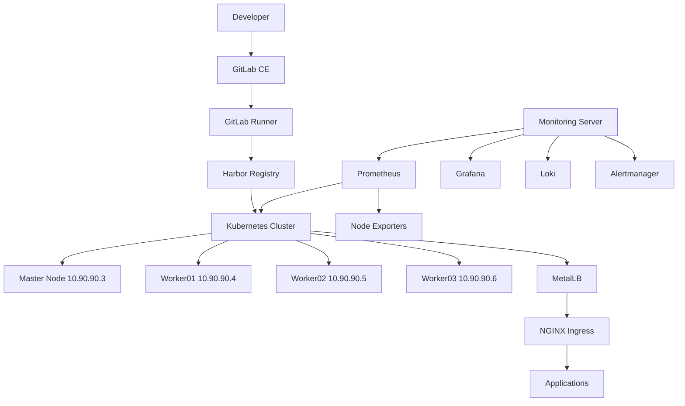

# Enterprise Kubernetes DevOps Platform

A self-hosted DevOps platform built as a hands-on infrastructure lab using Kubernetes, GitLab CE, GitLab Runner, Harbor Registry, MetalLB, NGINX Ingress, Prometheus, Grafana, Loki and Linux servers.

This project demonstrates practical experience with cloud-native infrastructure, private container registries, CI/CD foundations, Kubernetes networking, observability and Linux administration.

## Project Goals

- Build a multi-node Kubernetes environment on virtual machines
- Deploy a private container registry using Harbor
- Configure GitLab CE and GitLab Runner for CI/CD workflows
- Use MetalLB to provide LoadBalancer services in a lab network
- Expose applications through NGINX Ingress
- Monitor infrastructure and services with Prometheus, Grafana, Loki and Node Exporter
- Document real troubleshooting steps from implementation

## Infrastructure

| Component | IP Address | Purpose |
| --- | --- | --- |
| Kubernetes Master | 10.90.90.3 | Control plane and cluster administration |
| Worker01 | 10.90.90.4 | Kubernetes worker node |
| Worker02 | 10.90.90.5 | Kubernetes worker node |
| Worker03 | 10.90.90.6 | Kubernetes worker node |
| GitLab CE | 10.90.90.7 | Source control and CI/CD platform |
| Harbor Registry | 10.90.90.8 | Private container image registry |
| Monitoring Server | 10.90.90.9 | Prometheus, Grafana, Loki and Alertmanager |

## Core Stack

- Kubernetes
- Containerd
- Docker
- GitLab CE
- GitLab Runner
- Harbor Registry
- MetalLB
- NGINX Ingress
- Prometheus
- Grafana
- Alertmanager
- Loki
- Promtail
- Node Exporter
- Metrics Server
- Kube State Metrics

## Architecture



## Repository Structure

```text
.
├── README.md
├── docs/
│   ├── architecture.md
│   ├── infrastructure.md
│   ├── kubernetes.md
│   ├── harbor.md
│   ├── monitoring.md
│   ├── troubleshooting.md
│   └── lessons-learned.md
├── kubernetes/
│   ├── metallb-ipaddresspool.yaml
│   └── metallb-l2advertisement.yaml
├── harbor/
│   └── hosts.toml
├── monitoring/
│   └── prometheus-targets.yml
└── LICENSE
```

## Documentation

- [Architecture](docs/architecture.md)
- [Infrastructure](docs/infrastructure.md)
- [Kubernetes](docs/kubernetes.md)
- [Harbor Registry](docs/harbor.md)
- [Monitoring](docs/monitoring.md)
- [Troubleshooting](docs/troubleshooting.md)
- [Lessons Learned](docs/lessons-learned.md)

## Security Note

Sensitive values such as GitLab Runner registration tokens, passwords and private credentials are intentionally excluded from this repository.
